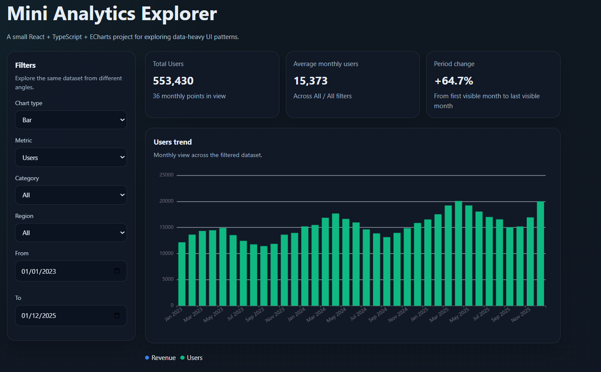

# Mini Analytics Explorer

A small React + TypeScript + ECharts project inspired by data-heavy UI patterns found in analytics products.

The goal was to explore how charting, filtering and tabular data interact in a real-world scenario, with a focus on clarity, consistency and simple component structure.

---

## What this project demonstrates

- Metric switching (Revenue / Users / Orders)
- Chart type switching (Bar / Line)
- Filter-driven UI (category, region, date range)
- Coordination between chart and table views
- Summary-level insights via KPI cards
- Consistent visual mapping (shared metric color config)
- Clean separation between data, config and presentation

---

## Dataset

The mock dataset is intentionally sized to feel realistic without requiring a backend:

- 3 years of monthly data
- 4 customer segments
- 3 regions
- 432 raw rows before aggregation

This allows meaningful filtering, aggregation and UI interaction patterns.

---

## Why this project

Instead of reusing existing code, I explored how analytics tools structure visualisation components and built a simplified standalone version to better understand:

- data-to-UI mapping
- filter-driven state
- reusable visual configuration
- consistency between chart elements (e.g. legend and series colours)

---

## Run locally

```bash
npm install
npm run dev
